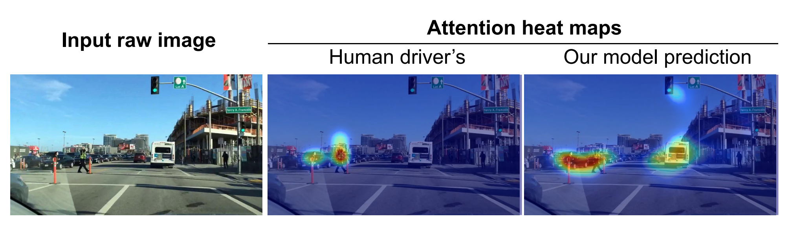
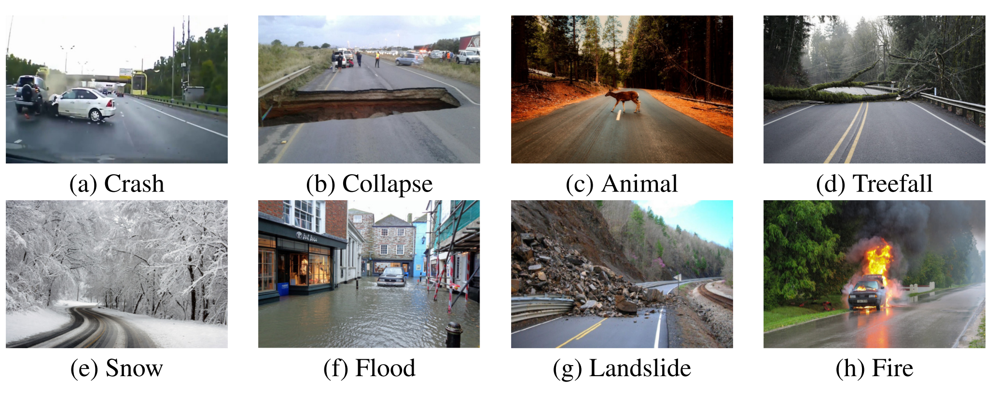

# Future Research

## Additional Models

This section captures ideas for additional machine vision models that could be deployed in parallel with the existing system. The architecture for this system was built to scale indefinitely as the number of models increases, so adding an additional model should be fairly simple other than the time to train it.

### Driver Attention

One area of interest would be looking for ways to predict what the driver is attending to at any given moment, or identify cases where the driver's attention must be split between many different objects in front of them. A model could be built based upon eye-tracking data from vehicle drivers to predict these situations of split attention. Theoretically, situations where a driver has split attention should be higher risk, and if someone is commonly needing to split attention, calling this to their attention may help mitigate that risk.

See [Predicting Driver Attention in Critical Situations](https://arxiv.org/abs/1711.06406) for motivating examples and data.

### Major Road Hazard

On the road there are many potential hazards that could raise the risk of driving (existing crashes, debris on the road, flooded roadways, etc...). A model could be built to detect these situations. If someone frequently drives in areas with these types of conditions, that is likely something that would raise their risk as a driver. Alternatively, an insurance company could implement a model that detects these types of risky events, and diverts drivers to other routes that avoid the risky situation.

See [Detecting Unsigned Physical Road Incidents from Driver-View Images](https://arxiv.org/abs/2004.11824) for motivating examples and data.

## Multi-Image Analysis

One key area of improvement would be adding the ability to consider multiple images together. While the current solution only considers each image in isolation (i.e. "Is there a stop light in my view?"), the would be the potential to consider across multiple images and make more meaningful detections (i.e. "Am I approaching a red stop light quickly?")

### Vehicle Approach Speed

Traditional telematics systems treat "hard braking events" very harshly. The general logic on this being that the hard braking events are indicative of near-miss crashes. While on that specific day you may have been lucky and you stopped soon enough, on a future day you may not be. Someone who commonly has these hard braking events likely won't continue being lucky forever!

A model could be built that gives additional context behind these events. Looking between a few frames right before a braking event, it would be possible to detect the object that caused the braking event, and calculate the approach speed of that object or how much notice the driver had about the object before they started to brake. Any of that data would give more or less weight to the fact that the braking event occurred.

### Stop Light Response

As a driver, it is very common to be driving up to a green stop light, and have it turn yellow. In that moment you decide either to hit your brake or drive through the yellow light. A machine vision system could look at when a light turns yellow and determine how long it took for the driver to react as well as determine how appropriate their reaction (stop or go) was. As with all of these other ideas, this data could be used to determine how risky the driver is, or to give them feedback on how to be a safer driver in the future.

## Model Applicability to Insurance Pricing

All of the research discussed in this paper effectively boils down to a form of feature creation. On its own, knowing "number of cars visible in the frame" or "it is currently raining" are not particularly useful points of information for an insurance company. What is useful is using that data in a downstream system to make determinations about the riskiness of an individual driver. A large branch of additional research that could be explored would be combining the features created through all of these machine vision models with a downstream target such as "amount of insurance dollars paid in a subsequent 1 year period". Such a model could be used by an insurance company to determine the appropriate discount someone deserves based upon how high/low risk they appear to be.
