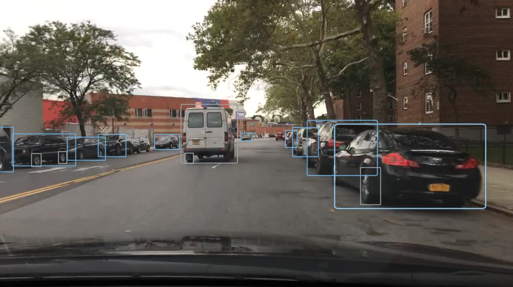

# Rekognition Road Object Detection  

## Context

The [AWS Rekognition API](https://aws.amazon.com/rekognition/) can detect many different objects and classifications from a variety of different domains. Included in the supported labels are many objects which would be applicable to road hazards or additional contextual information. The theory with this "model" is that one could simply count the number of labels from each class Rekognition detects, and use that count in downstream models.

Below is a sampling of supported labels that were of interest (all of these labels are automatically detected at no marginal cost):

| Location Type     | Time of Day | Road Constructs | Vehicles         | Humans       | Bikers          | Animals    |
|-------------------|-------------|-----------------|------------------|--------------|-----------------|------------|
| "Building"        | "Sunrise"   | "Intersection"  | "Transportation" | "People"     | "Bicycle"       | "Deer"     |
| "Downtown"        | "Sunset"    | "Stopsign"      | "Automobile"     | "Person"     | "Bike"          | "Elk"      |
| "Alleyway"        |             | "Traffic Light" | "Vehicle"        | "Pedestrian" | "Mountain Bike" | "Zebra"    |
| "Metropolis"      |             | "Road Sign"     | "Car"            | "Standing"   | "Mountain Bike" | "Bear"     |
| "Office Building" |             |                 | "Taxi"           | "Walking"    | "Motorcycle"    | "Elephant" |
| "Stadium"         |             |                 | "Antique Car"    |              | "Motor Scooter" |            |
| "Urban"           |             |                 | "Jaguar Car"     |              |                 |            |
| "Parking Lot"     |             |                 | "Sports Car"     |              |                 |            |
| "Tunnel"          |             |                 | "Race Car"       |              |                 |            |
| "Construction"    |             |                 | "Pickup Truck"   |              |                 |            |
| "Highway"         |             |                 | "Suv"            |              |                 |            |
| "House"           |             |                 | "Van"            |              |                 |            |
| "Mobile Home"     |             |                 | "Tow Truck"      |              |                 |            |
| "Dirt Road"       |             |                 | "Truck"          |              |                 |            |
| "Offroad"         |             |                 | "Moving Van"     |              |                 |            |
| "Forest"          |             |                 | "Rv"             |              |                 |            |
|                   |             |                 | "Tour Bus"       |              |                 |            |
|                   |             |                 | "School Bus"     |              |                 |            |
|                   |             |                 | "Trailer Truck"  |              |                 |            |
|                   |             |                 | "Snowplow"       |              |                 |            |
|                   |             |                 | "Tractor"        |              |                 |            |
|                   |             |                 | "Streetcar"      |              |                 |            |
|                   |             |                 | "Tram"           |              |                 |            |
|                   |             |                 | "Trolley"        |              |                 |            |
|                   |             |                 | "Cable Car"      |              |                 |            |
|                   |             |                 | "Train"          |              |                 |            |
|                   |             |                 | "Police Car"     |              |                 |            |
|                   |             |                 | "Fire Truck"     |              |                 |            |
|                   |             |                 | "Ambulance"      |              |                 |            |

## Model Implementation

In order to use this API, a Lambda function simply invoked the API by passing the bytes of individual images. The entirety of its implementation was approximately 10 lines of code. For certain, the amount of power obtained through using this service was large compared to the amount of work needed. It is clear why a team/company that does not have access to data scientist resources would use this API for basic detections.

## Performance

It was not possible to assess the performance of this model because their was a lack of applicable data. Certainly before this model were to be deployed in practice, a dataset would need to be collected to better understand how well it performs at this task. As discussed in the [Road Test](../Road-Test.md), the model appeared to perform well at vehicle detection and intersection detection, but it was not possible to test other labels.

As a simple test, look back at the photo at the top of this page. Try to spot missed "car" and "wheel" labels in the image. While the model appears to do well, it certainly is not perfect. Additional research would be needed to understand where it is failing, and determine if that level of accuracy is acceptable.

## Future Enhancements

The main enhancement needed would simply be to better understand the performance of rekognition. The BDD100k dataset could be used to an extent (though not all the labels are compatible). More likely what would be needed is a new dataset with labels directly applicable to what an insurance company intends to use the model for at the end.

Building on the idea of more applicable labels, likely using the [AWS Rekognition Custom Labels](https://aws.amazon.com/rekognition/custom-labels-features/) AutoML solution to build models more applicable to the intended use would be better than using the off-the-shelf Rekognition labels provided by Amazon.
