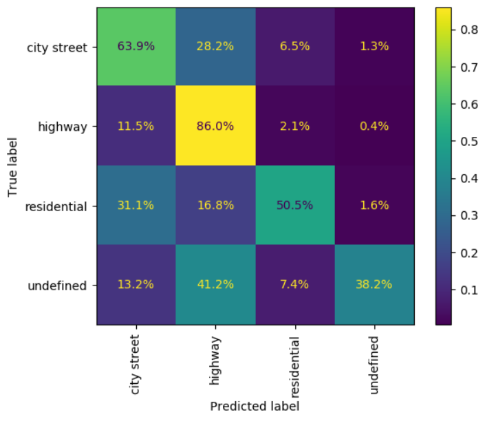

# Street Category Classifier

## Purpose  

WIP - Rewrite Purpose
The purpose of this model is to detect the light level (a.k.a. time of day) that the driver has vision of. The motivation here being that dawn/dusk is known to be the most risky time of day to drive. [^1] Potentially time of day could be approximated by just using a clock, but the relationship is not that simple.

[^1]: WIP - Citation Needed

> Light Level ~ Clock Time + Timezone + Geographic Position + Vehicle Heading + etc...

Using machine vision to visually assess "is the sun rising/setting in front of me right now?" is seemingly simpler than trying to think through all of that complexity.

The proposed model takes a single 3 x 224 x 224 image as input, and outputs probability of 4 classes:  
  
1) Day  
2) Dawn/Dust  
3) Night  
4) Undefined  
  
In practice, the Undefined class is almost never used in the training data. It is mostly reserved for totally artificial environments such as a tunnel where no daylight is visible in the photo.

## Data Considerations

WIP - Rewrite Data Considerations

WIP - Add considerations around classes that were binned

The model was trained using the BDD100k dataset [as described previously](../Dataset.md). This dataset has approximately 70,000 training images and 10,000 validation images.

Images were resized down to 224 x 224 pixels in order to align with the Sagemaker Image Classification container.

The dataset was highly imbalanced initially. As shown below, data was down-sampled for training. Validation statistics reported further down are based upon the original validation dataset.

|    Level    | Original Count | Down Sample Rate | Final Count |
| :---------: | :------------: | :--------------: | :---------: |
| city street |     43,516     |       25%        |   10,820    |
|   highway   |     17,379     |       50%        |    8,620    |
| residential |      8074      |       100%       |    8,074    |
|  undefined  |      894       |       100%       |     894     |
|    Total    |     69,863     |      40.7%       |   28,408    |

## Model Architecture

The model was trained using the [AWS Sagemaker Image Classification](https://docs.aws.amazon.com/sagemaker/latest/dg/image-classification.html) container. The model is trained using MXNet, it is a convolutional neural network. Beyond that, the AWS user documentation unfortunately does not give a ton of details on the architecture built behind the scenes. A raw visualization of the architecture exported from Sagemaker [can be found here](images/model_arch-scene-timeofday.svg). It appears to match the ResNet architecture[^2] terminating with a 4-node classification head.

[^2]: [ResNet Architecture Paper](https://arxiv.org/abs/1512.03385)

Below are the key hyperparameters that were selected:

| Hyperparameter     | Value         | Notes                                                                                                             |
| ------------------ | ------------- | ----------------------------------------------------------------------------------------------------------------- |
| Epochs             | 6             |                                                                                                                   |
| Pretrained Weights | 1             | AWS provides weights pretrained on the ImageNet with 11,000 categories                                            |
| Image Size         | 3 x 224 x 224 | Pretrained weights are only supported at this image size                                                          |
| Layers             | 18            | The minimum supported layer count. The model did show elements of overfitting even at this restricted layer count |
| Optimizer          | Adam          |                                                                                                                   |
| Learning Rate      | 0.001         |                                                                                                                   |
| Mini Batch Size    | 16            |

## Performance

Overall the performance of the model appears to be middle of the road with a 67% accuracy on validation. In general, the model's accuracy seems to be impacted by unclear definitions of "residential" vs "city street" in the dataset. The intended definition seems to be single-family dense neighbors (residential) versus commercial district streets (city street). However, these are fairly similar in the grand scheme of all roads that can exist. Potentially re-assessing the data collected and the labels to have a broader span of classes (i.e. dirt road, suburban residential, small town commercial) would be a better way to assess performance.

### F1 Score

|              | precision | recall | f1-score | support |
| :----------: | :-------: | :----: | -------- | ------- |
| City Street  |   0.85    |  0.64  | 0.73     | 6112    |
|   Highway    |   0.52    |  0.86  | 0.65     | 2499    |
| Residential  |   0.58    |  0.51  | 0.54     | 1253    |
|  Undefined   |   0.32    |  0.38  | 0.35     | 136     |
|              |           |        |          |         |
|   accuracy   |   0.67    | 10000  | 0.67     | 769     |
|  macro avg   |   0.57    |  0.60  | 0.57     | 10000   |
| weighted avg |   0.73    |  0.67  | 0.68     | 10000   |

### Confusion Matrix

## Future Enhancements

WIP rewrite performance

The model trained on the BDD100k dataset does not exactly meet the intended use of that data. Teaching autonomous vehicles to drive isn't directly in line with my intended use (identifying risks to a *human* driver). While it was good enough for a school project, future research should look to collect a different dataset more in line with this use case. A big gap applicable to this "time of day" model was the definitions of daytime/dusk/night were inconsistent between photos. A better dataset for this purpose would likely have a numeric target like "hours till sunset" which is more objective.

Additionally, looking to rebuild the model in a different tool stack would likely be good. The AWS Sagemaker Image Classification container was used as a learning opportunity, but the lack of control I had over the model was limiting. The model was prone to overfitting, and that sagemaker container does not give many options for a data scientist to mitigate those issues.

## Appendix

### Model Interpretation

Below is an example image from each class where the model was highly confident in the correct label. When reading these images, a blue region means that it contributed to the confidence, and a red region means it detracted from the confidence.  

+ [City Street](images/scene-citystreet-shap.jpeg)
+ [Highway](images/scene-highway-shap.jpeg)
+ [Residential](images/scene-residential-shap.jpeg)
+ [Undefined](images/scene-undefined-shap.jpeg)
