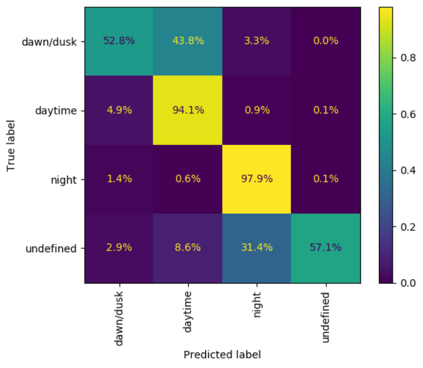
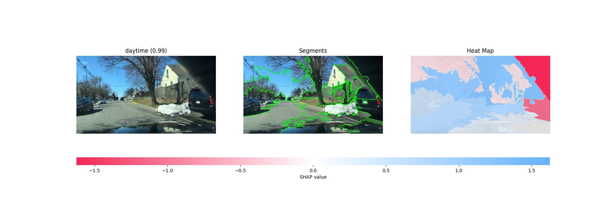
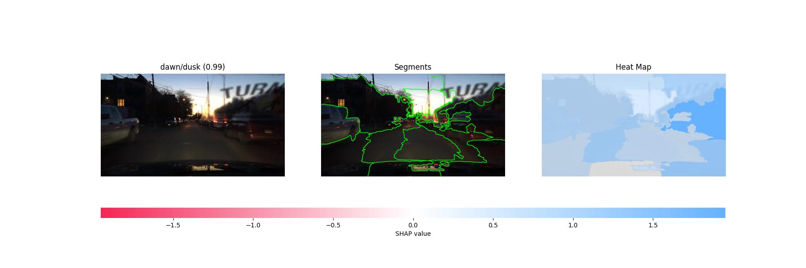
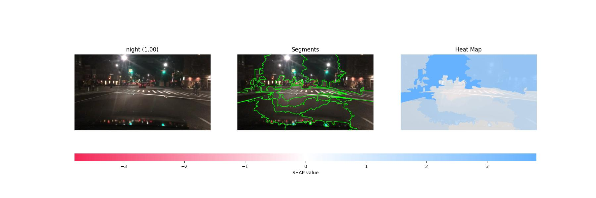
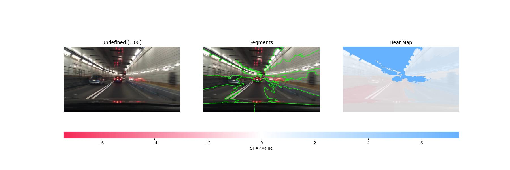

# Time of Day Classifier

## Purpose  

The purpose of this model is to detect the light level (a.k.a. time of day) that the driver has vision of. The motivation here being that dawn/dusk is known to be the most risky time of day to drive. [^1] Potentially time of day could be approximated by just using a clock, but the relationship is not that simple.

[^1]: WIP Citation Needed

> Light Level ~ Clock Time + Timezone + Geographic Position + Vehicle Heading + etc...

Using machine vision to visually assess "is the sun rising/setting in front of me right now?" is seemingly simpler than trying to think through all of that complexity.

The proposed model takes a single 3 x 224 x 224 image as input, and outputs probability of 4 classes:  

1) Day
2) Dawn/Dust
3) Night
4) Undefined

In practice, the Undefined class is almost never used in the training data. It is mostly reserved for totally artificial environments such as a tunnel where no daylight is visible in the photo.

## Data Considerations

The model was trained using the BDD100k dataset [as described previously](../Dataset.md).

Images were resized down to 224 x 224 pixels in order to align with the Sagemaker Image Classification container.

The dataset was highly imbalanced initially. As shown below, data was down-sampled for training. The final validation dataset was held as is.

WIP - ADD data about down-sampled photos.

## Model Architecture

WIP

## Performance

### F1 Score

|              | precision | recall | f1-score | support |
|:------------:|:---------:|:------:|----------|---------|
|   dawn/dusk  |    0.57   | 0.53   | 0.55     | 778     |
|    daytime   |    0.93   | 0.94   | 0.94     | 5258    |
|     night    |    0.98   | 0.98   | 0.98     | 3929    |
|   undefined  |    0.74   | 0.57   | 0.65     | 35      |
|              |           |        |          |         |
|   accuracy   |       |   | 0.92   | 10000    |
| macro avg    | 0.80      | 0.75   | 0.78     | 10000   |
| weighted avg | 0.92      | 0.92   | 0.92     | 10000   |

### Confusion Matrix

## Future Enhancements

WIP

## Appendix

### Time Series of a Trip

<iframe src="../images/timeseries_weather.html" height="500px" width="1300px"></iframe>

This time series shows the models confidence over the duration of a 30 minute drive taken at approximately 7 PM on an early summer night. The model clearly lost confidence when entering a downtown region of the city where the skyline blocked its view of the sun. Additionally, the model's confidence changed materially when the trip faced Southwards on a wide-open stretch of road.

### Model Interpretation

Below is an example image from each class where the model was highly confident in the correct label. When reading these images, a blue region means that it contributed to the confidence, and a red region means it detracted from the confidence.

#### Day

#### Dawn/Dusk

#### Night

#### Undefined

