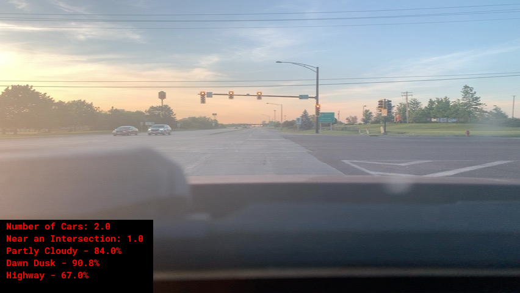

# Project Goal

This project looks to demonstrate ways that a camera could supplement traditional telematics devices in order to capture additional contextual information about a vehicle's driving habits. If such a solution were to be deployed, the information captured by the camera would be fed as features into a downstream supervised learning model which predicts long term likelihood of incurring losses on an insurance policy.

The idea behind this project is that a ton of contextual information is available from the driver's perspective when operating a vehicle. The driver can see all the other entities operating on the road, they can see any stop lights or roadsigns that affect how they should drive, they can see light/weather conditions that should change how cautiously they drive, and really many more. The main sense humans use when they drive is their vision, so theoretically almost everything the human is contemplating when operating a vehicle should be observable through a machine vision solution.

WIP - re-read one last time